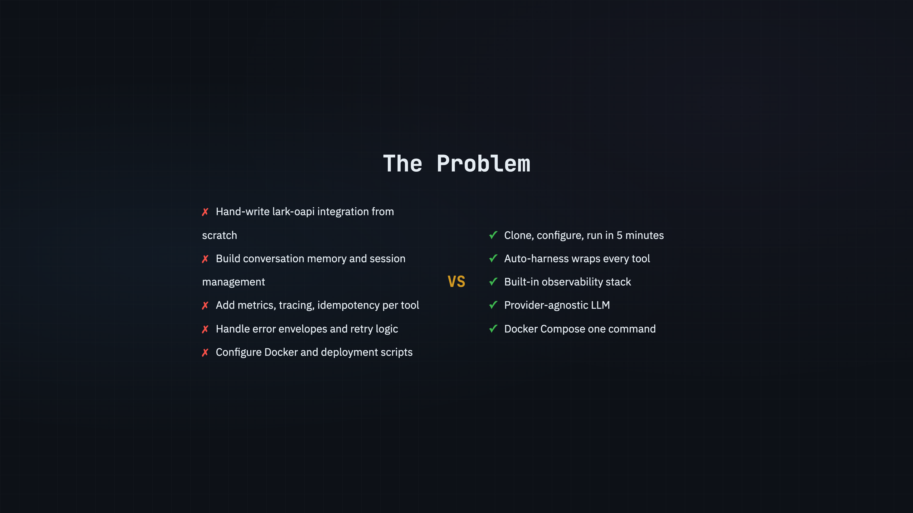
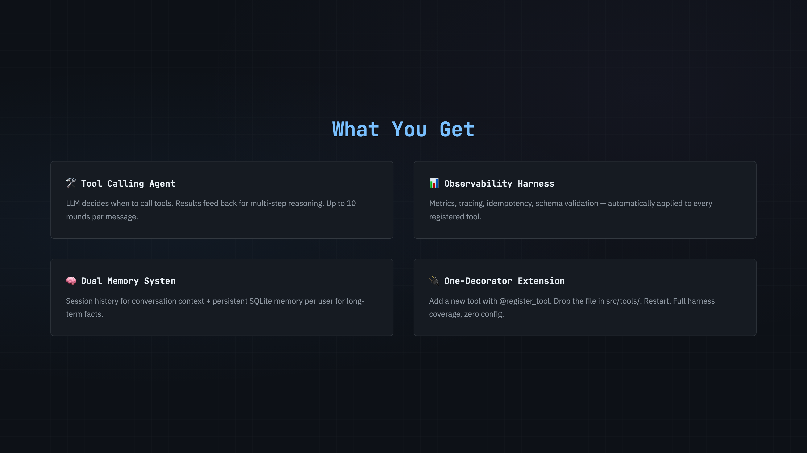
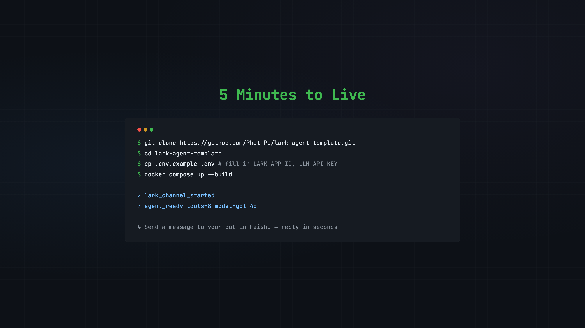
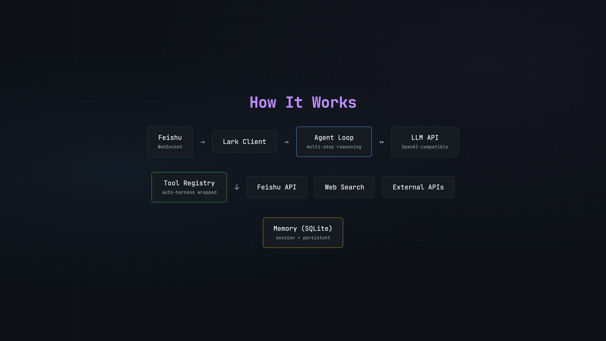

# 🦅 Lark Agent Template

[](https://www.python.org/downloads/)
[](LICENSE)
[](https://fastapi.tiangolo.com/)
[](https://www.docker.com/)

<pre>
██       ████    ███████    ██
██      ██   ██     ██      ██
██      ██████      ██      ██
██      ██   ██     ██      ██
██████  ██   ██     ██      ██
</pre>

**A ready-to-use Feishu/Lark AI agent with tool calling, observability harness, and extensible plugin system.**

📖 [查看简体中文文档](README.zh.md)

---

## Why Lark Agent Template?



**Clone, configure, run. Your AI assistant is live in 5 minutes.**

| Feature | Lark Agent Template | Feishu-OpenAI | nonebot2 |
|---------|:-------------------:|:-------------:|:--------:|
| Language | Python | Go | Python |
| Tool calling with auto-harness | ✅ | ❌ | ❌ |
| Observability (metrics, tracing) | ✅ built-in | ❌ | ❌ |
| Provider-agnostic LLM | ✅ | OpenAI only | via plugins |
| Template (clone & go) | ✅ | ❌ | ❌ |
| Conversation memory | ✅ session + persistent | ✅ | via plugins |
| Docker deployment | ✅ | ✅ | ✅ |

---

## ✨ Features



---

## 📋 Requirements

- Python 3.11+ (or Docker)
- A [Feishu/Lark Open Platform](https://open.feishu.cn/) app
- An LLM API key (OpenAI, DeepSeek, Mimo, or any OpenAI-compatible provider)

---

## 🚀 Quick Start



### Step 1 — Feishu App setup (do this first)

Go to [open.feishu.cn](https://open.feishu.cn/) and create an **Enterprise Custom App**, then:

**Credentials** (save these for `.env`):
- Copy **App ID** and **App Secret** from the Credentials tab

**Add bot capability:**
- Go to **Add App Capability** → enable **Bot**

**Permissions & Scopes** → add these scopes:

| Scope | Purpose |
|-------|---------|
| `im:message` | Receive messages |
| `im:message:send_as_bot` | Send messages as bot |

**Event Subscription:**
- Set mode to **Long connection (WebSocket)**
- Click **Add Event** → add `im.message.receive_v1`
- This event requires at least one of these permissions to be enabled first: **读取用户发给机器人的单聊消息** or **获取群组中用户@机器人消息** — confirm they show 已开通 in Permissions & Scopes before adding the event

**Publish:**
- Go to **Version Management** → create and publish a version
- If you are the enterprise admin, go to [admin.feishu.cn](https://admin.feishu.cn) → **App Management** → find your app → **Enable**

> Full permission list for all built-in tools: [docs/feishu-app-setup.md](docs/feishu-app-setup.md)

---

### Step 2 — Configure

```bash
git clone https://github.com/Phat-Po/lark-agent-template.git
cd lark-agent-template
cp .env.example .env
```

Edit `.env` — fill in your App ID, App Secret, and LLM API key.

---

### Step 3 — Run

**With Docker (recommended):**

```bash
docker compose up --build
```

**Without Docker (Python 3.11+ required):**

```bash
python -m venv .venv
source .venv/bin/activate
pip install -r requirements.txt
uvicorn src.main:app --host 0.0.0.0 --port 8080
```

Look for this in the logs — it means the bot is live:

```
Lark Agent Template started
  Tools: 15 loaded
connected to wss://msg-frontier.feishu.cn/ws/v2 ...
```

**Then search for your app name in Feishu and send it a message.**

---

## 🛠️ Built-in Tools

| Tool | Description | Risk Level |
|------|-------------|:----------:|
| `get_calendar` | Read calendar events for a date range | read |
| `create_calendar_event` | Create events with attendees | write |
| `delete_calendar_event` | Delete a calendar event | destructive |
| `get_tasks` | List tasks (filter by status/keyword) | read |
| `get_task` | Get a single task by GUID | read |
| `create_task` | Create a task with due date and assignees | write |
| `delete_task` | Delete a task | destructive |
| `search_docs` | Search Feishu documents by keyword | read |
| `read_doc` | Read full document content | read |
| `create_doc` | Create a new document | write |
| `delete_doc` | Delete a document | destructive |
| `move_file` | Move a file to another folder | write |
| `create_folder` | Create a folder in Drive | write |
| `send_message` | Send a message to user or group | write |
| `search_web` | Search the web via SerpAPI | read |

---

## 🔧 Configuration

All configuration is via environment variables. Copy `.env.example` to `.env` and fill in:

| Variable | Default | Description |
|----------|---------|-------------|
| `LARK_APP_ID` | — | Feishu app ID (required) |
| `LARK_APP_SECRET` | — | Feishu app secret (required) |
| `LLM_API_KEY` | — | LLM provider API key (required) |
| `LLM_BASE_URL` | `https://api.openai.com/v1` | LLM API base URL |
| `LLM_MODEL` | `gpt-4o` | Model name |
| `MAX_HISTORY_ROUNDS` | `20` | Max conversation turns in context |
| `MAX_TOKEN_BUDGET` | `3000` | Max tokens in LLM response |
| `REQUIRE_WRITE_CONFIRMATION` | `true` | Ask user before write/destructive tools |
| `SEARCH_API_KEY` | — | SerpAPI key (optional, for web search) |
| `DB_PATH` | `data/agent.db` | SQLite database path |
| `LOG_LEVEL` | `INFO` | Logging level |

**Switch LLM provider** by changing `LLM_BASE_URL`, `LLM_API_KEY`, and `LLM_MODEL`. No code changes needed.

---

## 📐 Architecture



See [docs/architecture.md](docs/architecture.md) for the full design.

---

## ➕ Adding Custom Tools

```python
from src.tools.registry import register_tool
from src.harness.result import tool_ok

@register_tool(
    name="get_weather",
    description="Get current weather for a city",
    parameters={
        "type": "object",
        "properties": {
            "city": {"type": "string", "description": "City name"},
        },
        "required": ["city"],
    },
    risk_level="read",
)
async def get_weather(city: str) -> dict:
    # your implementation here
    return tool_ok({"city": city, "temp": "25°C"})
```

Place the file in `src/tools/` and restart — it auto-registers with full harness coverage.
See [docs/adding-tools.md](docs/adding-tools.md) for the full guide.

---

## 📖 Documentation

- [Feishu App Setup](docs/feishu-app-setup.md) — Create and configure your Feishu app
- [Adding Tools](docs/adding-tools.md) — Build custom tools with the harness
- [Architecture](docs/architecture.md) — Message flow, harness layer, memory system
- [Local Docker Deployment](docs/deploy-local-docker.md) — Run on your laptop
- [VPS Deployment](docs/deploy-vps.md) — Deploy to a Linux server

---

<details>
<summary>🚀 Advanced: VPS Deployment</summary>

Deploy to a Linux VPS for 24/7 availability:

```bash
ssh user@your-vps
git clone https://github.com/Phat-Po/lark-agent-template.git
cd lark-agent-template
cp .env.example .env && nano .env
docker compose up -d --build
```

The agent connects outbound via WebSocket — no inbound ports needed.

See [docs/deploy-vps.md](docs/deploy-vps.md) for systemd service setup and firewall notes.
</details>

<details>
<summary>🛠️ Development</summary>

```bash
python -m venv .venv
source .venv/bin/activate
pip install -r requirements.txt
pip install -e ".[dev]"
pytest
```

Run tests:
```bash
pytest tests/
```
</details>

---

## 📄 License

MIT © 2026 [Phat-Po](https://github.com/Phat-Po)

---

<div align="center">
  <sub>Built with <a href="https://github.com/larksuite/oapi-sdk-python">lark-oapi</a> · Star this repo if it helped you!</sub>
</div>
